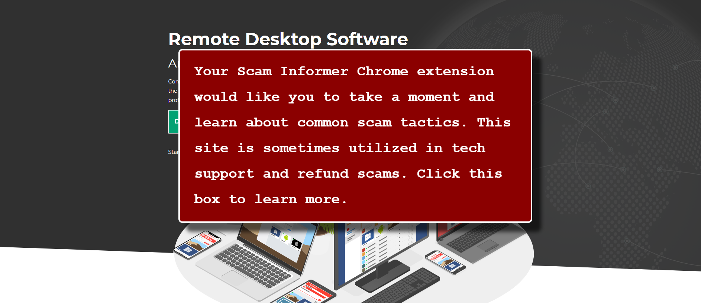
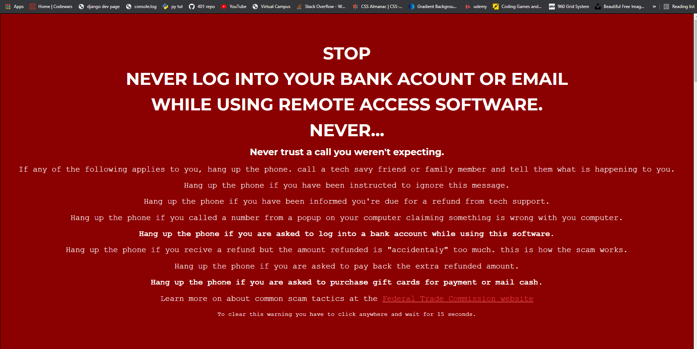

# This is a chrome extension that informs people about common remote access scams when they load remote access websites. 

### the site is not blocked but information about how the scam works is displayed in pop ups that cannot be ignored.

Screen shots of the extension in action.

when a user visits a website that will allow them to install remote access software a pop up will grab thier attention.
[]

when the user clicks on the first pop up a second pop up fills the page. the second pop up lists out things to watch for in common refund and tech support scams. The second pop up also directs the user to the Federal Trade Commission website where they can learn more about how diferent scams work.
[]

the second popup is cleared when the user clicks and holds for 15 seconds. the pop up wont show up again for some time. if the user still wishes to use the site after the pop us is clicked away, they can.

I hope to make this extension to catch people at a key stage in the scam before the scammer has access to thier victims computer.

the scams have various stories but they usually follow the same flow:
1. The scammer claims to be tech support.
2. The scamer claims a refund is due and the victim belives they are owed money.
3. The scammer instructs the victim to log in to a remote acceess program
4. Once the scammer has control of the victims computer they instruct the customer to visit thier bank site
5. Once the scammer can see how much money the victim has the scammer knows how much money they can get from the victim.
6. The scammer pretends to initiate a refund, what they really do is alter the html on the website so it look like money has been deposited.
7. This is the scam. the scammer pretends to deposit too much money and asks for the extra balance to be sent back in gift cards, or sometimes cash.

I used to think that putting up a warning whereever giftcards are sold would prevent a lot of these refund scams from working, but no one is adding warnings to gift cards.

Some companies have tried adding a warning to the site so the site can't be used for fraud, but by the time the victim is in view of these warnings the scammer already has control of the computer and hide the easily.

The idea is to inform potential victims how the refund scams work before the scammer is able to control the computer. At step 3. this is the pinch point. there are a handful of websites potential victims need to visit before the scam can play play. 

So that's what this is. It's an educational pop up that is triggered when someone loads one of the popular remote viewing sites. it is meant to be installed by someone else to protect thier less tech-savy and more trusting loved ones.

Before your loved one downloads software to let someone else control thier computer, they are briefly educated on red flags they are about the encounter and informed they are being scammed. the pop up also links the user to the Federal Trade Commissions website on fraud.
